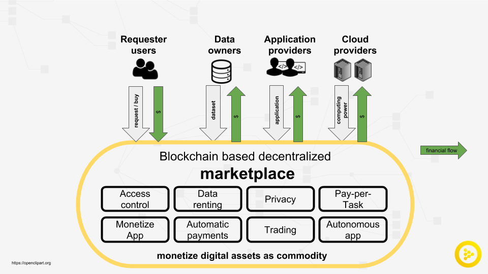

# iexec_workshop

iExec, being blockchain-based, allows you to manage your computing transactions in a secure and decentralized environment.
In order to transact between multiple parties within iExec, an Ethereum wallet is required.

First, you will need to create your Ethereum wallet and credit it with Ethereum tokens (ETH), before running the application.

While iExec is in its development phase, we allow transactions on Ethereum’s Kovan Network. 
Sometimes referred to as test network, it uses Kovan ETH tokens that hold no real value and are used solely for testing purposes.


|  |
|:--:|
| *iExec Ecosystem* |


|  |
|:--:|
| *iExec workflow* |


# Introduction

We recommend to read a short introduction of the iExec Marketplace

<https://docs.iex.ec/intro.html>

and an overview of the iExec solution stack

<https://docs.iex.ec/products.html>


Let's introduce important concepts and definitions of iExec and blockchain technology.
     

**Ethereum:**

Ethereum is an open-source, public, blockchain-based distributed computing platform and operating system featuring smart contract functionality.
Ethereum allows programmers to write smart contracts - code which is executed on the
blockchain virtual machine. This represents a potential revolution in designing and executing services such as investment, finance, crowdfunding, internet of things, insurance, prediction markets,
gambling, distributed data processing, and many more - in essence, disrupting a wide swath of centralized incumbents.

**Smart Contract:**

Smart contracts help you exchange anything of value in a transparent, conflict-free way without needing the services of a middleman or third party. It is a computer protocol intended to digitally facilitate the negotiation of a contract. Smart contracts use blockchain to automate consensus over transactions. The transactions within these contracts are fully publicly auditable, traceable and irreversible.

**Tokens:** 

These are the tokens that act like native currency in their respective DAPPS, RLC is the token to use the services in iExec then you will need to pay with RLC.
While these tokens have monetary value they won’t give you any particular rights or privilege within the network itself.

**RLC:**

RLC tokens will be used to access the resources provided through iExec. It is the unique method of payment between application providers, server providers and data providers.

**Gas:**

Transaction execution (smart contract) takes some amount of gas in ETH, Each lines of code executed cost a few amount of gas.
This gas is used to calculate the amount of fees that need to be paid to the network in order to execute an operation. 
Ethereum miners, who perform all the important tasks of verifying and processing a transaction, are awarded this particular fee for their computational services.
    

**Dapp:**

Dapp is an abbreviated form for decentralized application. For a dapp, the backend code is based on a decentralized peer-to-peer network. For example, dapps can be based on Ethereum smart contracts. Contrast this a with a normal app, where the backend code runs on centralized servers.
iExec Dapps are powered by the decentralized cloud infrastructure with machines distributed over the Ethereum network. Rather than relying on computing power from a single centralized data center.

**Dataset:**

A dataset is a collection of related sets of information that is composed of separate elements, such as numbers, semantic-data or variables, that can be manipulated by a computer for practical application. 
For example, iExec data to be used within the medical industry can be use healthcare professionals, care providers, insurers, and government agencies.

**Task:**

A task within iExec is an instance where computing power is required.

**Requester:**

An individual or enterprise requesting the use of cloud resources through iExec.

**Worker:**

They are individuals or companies who own computing resources and are willing to make them available for the computation of tasks against payments in RLC.

**Worker Pool:**

Worker pools organize the contributions of Workers.  A worker pool is a group of machines, often with similar characteristics, that is led by a Pool Manager.

**TEE:**

A trusted execution environment (TEE) is a secure area of a main processor.
It guarantees code and data loaded inside to be protected with respect to confidentiality and integrity.
A TEE provides security features such as isolated execution, integrity of applications executing with the TEE, along with confidentiality of their assets (wikipedia)

**Intel SGX:**

Intel SGX is used by iExec to secure computations and data running on untrusted machines over the distributed and decentralized network.


## 1. Install the SDK 

The iExec SDK and API provide a set of tools that allows all users to easily interact with iExec decentralized marketplace

Create a working directory for this tutorial, all setup files will be created locally.

```
npm -g install iexec
iexec --version
iexec --help

``` 

## 2. Wallet management 

The cryptocurrency wallet is a secure software program to interact with blockchains. 

The wallet enables user to send and receive digital currency, monitor their balance and conduct other operations as smart contract execution. 

iExec service runs on ethereum blockchain, as a collection of smart contracts. 

This transaction execution (smart contract) takes some amount of gas in ETH,
this gas is used to calculate the amount of fees that need to be paid to the network in order to execute an operation.

   * need RLC to access the computing resources.
   * need ether to interact with the services paying the necessary gas under the wood.
   

## 3. Setup your wallet with the iExec SDK

There is nothing to do!

We created and charge a wallet with Eth and RLC, ask where to download the related files. 

Unzip the file in the working directory, nothing else to do.
It contains all the necessary files to interact with the blockchain and the iExec marketplace. 

Then check your wallet 

```
   iexec wallet show
```
 to show your wallet balance 
 
```
address:    0xca10fe415a89f75784166ca32cf1384f26f9e479

✔ Wallet kovan balances [42]:
ETH:  0.099
nRLC: 50000

``` 

## 4. Finding computing resources

 
You can view the state of the current orderbook, the list of computing resources available, as a trade exchange.  

The following command shows the list of available order: 


Order Details:
 - id : id of the order
 - price: price of the order, iExec is a free market. free pricing.
 - pool: the worker pool order provider    
 - category: from category 1 tiny job until category 5 corresponding to a 1 hour task.  
   
   More detail on Pay-per-Task model <https://docs.iex.ec/paypertask.html>
 - timestamp: order creation date. 
 
 
```
iexec orderbook show
ℹ using chain [kovan]
✔ orderbook details:
- 
  id:        2050
  price:     10563
  pool:      0x4a02532aBD258929d211A660e155aB747eCa7F46
  category:  5
  timestamp: 2019-02-18T16:02:56.000Z
- 
  id:        2038
  price:     10955
  pool:      0x295732b566B785D24A839e57a4AEea0C849b6A4a
  category:  5
  timestamp: 2019-02-18T10:52:28.000Z
- 
  id:        1989
  price:     14208
  pool:      0x49327538C2f418743E70Ca3495888a62B587A641
  category:  5
  timestamp: 2019-02-07T10:16:44.000Z
- 
  id:        2026
  price:     15243
  pool:      0x295732b566B785D24A839e57a4AEea0C849b6A4a
  category:  5
  timestamp: 2019-02-14T09:15:52.000Z
- 
  id:        1988
  price:     15378
  pool:      0x49327538C2f418743E70Ca3495888a62B587A641
  category:  5
  timestamp: 2019-02-07T10:15:56.000Z

ℹ trade in the browser at https://market.iex.ec

``` 

  
## 5. iExec product in your web browser
  
In this section you will setup your wallet, the same you use in the sdk, and will connect to the dapp store to submit a Nilearn task.

MetaMask is a web browser add-on which enables anyone to run the Ethereum DApps and manage your wallet.

**Install and configure metamask with your wallet**
   
Follow instruction on the website 

https://metamask.io/ 

Copy the private key found in the wallet.json and import your wallet into metamask.


_**Warning:** keep your private key safe, you can loose all your cryptocurrencies._

Just a reminder even if we are on testing network kovan. 


Open your metamask extension and select import 
Click on the top righ mutlicolor circle to import a "New Account" 


Paste your private key (found in wallet.json)
 


## 6. the iExec dapp store.

The dapps store gets a lot of ready to use applications,
with default arguments to submit a task by filling a order with your execution request.

<https://dapps.iex.ec>

Metamask will ask to allow the connection.
 

- Look at the top right corner and explore the wallet management 

- Explore the page.
  
 
## 7. Select and execute an application: 


Nilearn is a Python module for fast and easy statistical learning on NeuroImaging data.

As a healthcare framework, user should manage private and sensitive medical data.

<https://nilearn.github.io/>

It leverages the scikit-learn Python toolbox for multivariate statistics with applications 
such as predictive modelling, classification, decoding, or connectivity analysis.

The example consists in plotting a statistical maps to measure the brain activity.

The second plot just applies a threeshold to highlight the most active brain area.

more details in <https://en.wikipedia.org/wiki/Statistical_parametric_mapping>

The initial example can be found here
<http://nilearn.github.io/auto_examples/plot_3d_and_4d_niimg.html>


The data are available at <www.neurovault.org>, a public repository of unthresholded statistical maps, 
parcellations, and atlases of the brain


Nilearn software manages the input data from different public repository or from local files 


### Prepare the dApp

Application must follow some requirements to be used in iExec, nothing really complex but we supports 
- application with finite elapsed time
- deterministic application, this is mandatory when requester ask for consolidated results, with a certain level of trust.
- no GUI, server mode only  
- dockerized application     

For more details  

<https://docs.iex.ec/dockerapp.html>

**Why using docker containers?**

A container is a standard unit of software that packages up code and all its dependencies so the application runs quickly and reliably from one computing environment to another.
Docker Engine is the most widely used container engine. A Docker container image is a lightweight, standalone, executable package of software that includes everything needed to run an application: code, runtime, system tools, system libraries and settings.
Docker is very convenient because it simplifies the deployment process, while ensuring consistency and repeatability in builds. Different people at different times will therefore build the same binary and obtain the same application behaviour.
Another feature of Docker is the possibility of creating new layers that build on top of existing images. These existing images could be yours, or images proposed by the community.

A list of applications examples with their docker images can be found at
<https://github.com/iExecBlockchainComputing/iexec-apps>
     

### The nilearn dApp

We present here quickly what has been done to support Nilearn on iExec.  
 
The docker source can be found 
<https://github.com/ericr6/nilearn>

From the initial code, we implement few modifications
 - disable interative plotting: nilearn usually run within iPython, we slightly modify the code to save the figure in a output directory. 
 - Data management is modified to accept data input, and prepare the next step, support private data as input. 
 - blockchain registration and Dappstore registration (very easy and quick). <https://docs.iex.ec/dockerapp.html> for more details.
    

### Execution the application.

From the Dapp store, you can directly submit the nilearn task described above. 
 
It should fail...

while your wallet is charged with RLC and ETH but the deal is denied.

but this is expected...

Why?

The smarts contract managing your task does not have a direct access to your wallet, 

First, you have to transfer the required amount (or more) of RLC to the account,
 
that allows the smart contract to start the task execution.
 
After the deal signed, monitor your execution by clicking on "my trades".  


## 8. Secure execution with iExec and intel SGX

One use case possible is to provide data to an application preserving the privacy and the ownership of the data.

iExec provides a full end to end data protection for blockchain-based computation using Intel® SGX.

End-to-end protection means full protection of the application data, user data, embedded data as well as application results.

Intel® Software Guard Extensions (SGX) is a technology that runs code and data in CPU-hardened “enclaves” or a ‘Trusted Execution Environment’ (TEE).

The enclave is a trusted area of memory where critical aspects of the application functionality are protected, helping keep code and data confidential and unmodified.

Your account must be topped up with RLC in order to trigger the execution of an application.

## 9. Run the dApp with privacy preserving

Nilearn is unfortunately not available within SGX, development of the SGX compatible docker image is in progress. 

The Nilearn docker image has to be customized and it has not been realized yet..

Today, an app developer can't realize the modification by his own.
    
Solution to automatically modified container are coming, but this is a active R&D topics, progressing at a fast pace.    

We propose to introduce the workflow with an existing use case, using Blender, a 3d rendering software, with private data.

The workflow will be exactly the same.      
   
The tutorial will be update asap.   


Privacy preserving feature is only available within the SDK.

In this section, you will manage a private execution on a cloud environment and using remote machine. 

**The host will never get access to your code, your data input and the results.** 

Privacy is provided by design, mixing blockchain and TEE solution.        


   ### 9.0 Specific dapp.
    
   The docker image used needs customization to run in Trust Execution Environments. 
   Today, application has to be prepared and it is not an easy step, but sgx is an emerging technology and tools to port docker application are progressing at a fast pace.
         
   ### 9.1 Encrypt and push data on a public server

Let’s locally encrypt the data and push it on a public file hosting service, so that the worker is able to access it:

```console
    iexec tee init # create iExec trusted execution folders tree
```

Download the blender model `iexec-rlc.blend <https://raw.githubusercontent.com/iExecBlockchainComputing/iexec-dapps-registry/master/iExecBlockchainComputing/Blender/iexec-rlc.blend>`_,
and copy the file in the *./tee/inputs* folder.

```console
    cp iexec-rlc.blend ./tee/inputs
```

Encrypt the input data:

```console
    iexec tee encryptedpush --application 0x2f3422f2805693cf741ee32707d57923ef6fa55f
    ℹ using chain [kovan]
    ⠅⡘ ▶ encrypting data from /home/eric/pm/test/tee/inputs and uploadingcli: Pulling from iexechub/sgx-scone
    Digest: sha256:e5f5bd685c211c58f2d6429dc21e5f61b27ca04b0d1fba8d0898fa30f0b36800

    Status: Image is up to date for iexechub/sgx-scone:cli

    ⡃⠀ ▶ encrypting data from /home/eric/pm/test/tee/inputs and uploading
    "cmdline": --sessionID 6860291353034118628213787713/application --secretManagementService 87.190.236.136  --url https://transfer.sh/NAsUs/scone-upload.zip

    ✔ data encrypted and uploaded
```

The above-mentioned command will return the command line parameters in string format that will be used in the next step.


   ### 9.2 Trigger trusted application execution


Prepare a work order and trigger the trusted application execution:

```console
    iexec order init --buy # init work order fields in iexec.json
```

Now open the iexec.json config file, and edit the app and command line fields:

  - Address for the blender app: 0x2f3422f2805693cf741ee32707d57923ef6fa55f
  - Command line provided by the " iexec tee encryptedpush ..." command

```console
     "order": {
        "buy": {
          "app": "0x2f3422f2805693cf741ee32707d57923ef6fa55f",
          "dataset": "0x0000000000000000000000000000000000000000",
          "params": {
          "cmdline": "--sessionID 6860291353034118628213787713/application --secretManagementService 87.190.236.136  --url https://transfer.sh/NAsUs/scone-upload.zip"
          }
        }
      }
    }
```

Select a worker pool supporting SGX:

```console
    iexec orderbook show --category 5
```

Select an order from the worker pool with the address 0x49327538C2f418743E70Ca3495888a62B587A641.
This worker pool supports SGX.

Fill the selected order:

```console
    iexec order fill 1963
    ℹ using chain [kovan]
    ℹ app price: 1 nRLC for app 0x2f3422f2805693cf741ee32707d57923ef6fa55f
    ℹ workerpool price: 15863 nRLC for workerpool 0x49327538c2f418743e70ca3495888a62b587a641
    ℹ work parameters:
    cmdline: --sessionID 6860291353034118628213787713/application --secretManagementService 87.190.236.136  --url https://transfer.sh/NAsUs/scone-upload.zip

    ? Do you want to spend 15864 nRLC to fill order with ID 1963 and submit your work Yes
    ✔ Filled order with ID 1963
    ✔ New work at 0x6bd60b2c01a161c46915c6a12553eaaee332f785 submitted to workerpool 0x49327538c2f418743e70ca3495888a62b587a641
```

Monitor your order:

```console
    iexec work show 0x6bd60b2c01a161c46915c6a12553eaaee332f785
    ℹ using chain [kovan]
    ✔ work 0x6bd60b2c01a161c46915c6a12553eaaee332f785 status is COMPLETED, details:
    m_workerpool:          0x49327538c2f418743e70ca3495888a62b587a641
    m_params:              {"cmdline":"--sessionID 6860291353034118628213787713/application --secretManagementService 87.190.236.136  --url https://transfer.sh/NAsUs/scone-upload.zip"}
    m_requester:           0x7800885445a481315fac90a8e8bdb62a0e538b71
    m_app:                 0x2f3422f2805693cf741ee32707d57923ef6fa55f
    m_dataset:             0x0000000000000000000000000000000000000000
    m_emitcost:            1
    m_uri:                 xw://api-tee-pool.iex.ec/7f667265-acb6-40a9-b199-42c07ad40d49
    m_stdout:
    m_resultCallbackProof: 0x9d6f1e3a18cf8bb9d5e8b755abace2d90f26d2196f1df7ed03a2a293d3ec7b7b
    m_iexecHubAddress:     0x12b92a17b1ca4bb10b861386446b8b2716e58c9b
    m_callback:            0x0000000000000000000000000000000000000000
    m_status:              4
    m_marketorderIdx:      1963
    m_stderr:
    m_beneficiary:         0x0000000000000000000000000000000000000000
    m_statusName:          COMPLETED
 ```
 
Download the work result once it is completed:

```console
    iexec work show 0x6bd60b2c01a161c46915c6a12553eaaee332f785 --download encryptedOutputFiles.zip
    ℹ using chain [kovan]
    ✔ work 0x6bd60b2c01a161c46915c6a12553eaaee332f785 status is COMPLETED, details:
    m_workerpool:          0x49327538c2f418743e70ca3495888a62b587a641
    m_params:              {"cmdline":"--sessionID 6860291353034118628213787713/application --secretManagementService 87.190.236.136  --url https://transfer.sh/NAsUs/scone-upload.zip"}
    m_requester:           0x7800885445a481315fac90a8e8bdb62a0e538b71
    m_app:                 0x2f3422f2805693cf741ee32707d57923ef6fa55f
    m_dataset:             0x0000000000000000000000000000000000000000
    m_emitcost:            1
    m_uri:                 xw://api-tee-pool.iex.ec/7f667265-acb6-40a9-b199-42c07ad40d49
    m_stdout:
    m_resultCallbackProof: 0x9d6f1e3a18cf8bb9d5e8b755abace2d90f26d2196f1df7ed03a2a293d3ec7b7b
    m_iexecHubAddress:     0x12b92a17b1ca4bb10b861386446b8b2716e58c9b
    m_callback:            0x0000000000000000000000000000000000000000
    m_status:              4
    m_marketorderIdx:      1963
    m_stderr:
    m_beneficiary:         0x0000000000000000000000000000000000000000
    m_statusName:          COMPLETED

    ✔ downloaded work result to file /home/eric/pm/test/encryptedOutputFiles.zip.none
```


Move the result in the './tee/encryptedOutputs/' folder to decrypt the result:

```console
   mv encryptedOutputFiles.zip.none ./tee/encryptedOutputs/encryptedOutputFiles.zip
```

Please note that the user who triggered the task (i.e. the SGX application) is the only one able to download the encrypted results.

When the application is triggered in a remote Intel® SGX decentralized node, the application will automatically

  1. Pull the encrypted user input data from remote file system (i.e. pushed in step 2)

  2. Retrieve the secret key (based on the Session ID) from the secret management server via a secure Intel® SGX provision channel

  3. The secret is then used to decrypt the user input data

  4. The decrypted data is used to feed the application execution

  5. The application result is encrypted by the secret key, and the encrypted result is further signed by a secure private key for an attestation of the trusted execution. The signature is verified on the blockchain


The procedure is done automatically in the trusted execution environment
(i.e. Intel® SGX enclave) without any user intervention.

   ### 9.3 Decrypt your result

The last step is decrypting the result:

```console
    iexec tee decrypt
    ⠉⠙ ▶ decryptingcli: Pulling from iexechub/sgx-scone

    Digest: sha256:e5f5bd685c211c58f2d6429dc21e5f61b27ca04b0d1fba8d0898fa30f0b36800
    Status: Image is up to date for iexechub/sgx-scone:cli

    ⠄⡙ ▶ decryptingArchive:  /encryptedOutputFiles.zip
      inflating: encryptedOutputs/0001.png

      inflating: encryptedOutputs/volume.fspf


    copy file /encryptedOutputs/0001.png to /decryptedOutputs/0001.png

    ✔ data decrypted in folder /home/eric/pm/test/tee/outputs

```

That’s it! Your completed and secure result is now available in the *./tee/outputs* folder.

Please note that only the corresponding user owns the key to decrypt the application's output result.

## Conclusion

In this hands on, 
  
  * Puts a step in crypto world...
  
  * Interact with the iExec products 
   
  * Discover how to use cloud services preserving privacy and ownership  
  
In the next release of iExec:
  
  * manage and monetize data set.
  * Build product with privacy preserving properties.
  
**Links**

- The iExec Dapp Store: https://dapps.iex.ec
- The iExec Marketplace: https://market.iex.ec
- The iExec Explorer: https://explorer.iex.ec
- The iExec Pools registry: https://pools.iex.ec
- The RLC faucet: https://faucet.iex.ec
- iExec main documentation: https://docs.iex.ec
- https://github.com/iExecBlockchainComputing : source code, SDK, dapps registry to apply for Dapp Store listing.


For technical support, contact us:

- Slack: https://slack.iex.ec

- Email : support@iex.ec

  


  
  
   
   